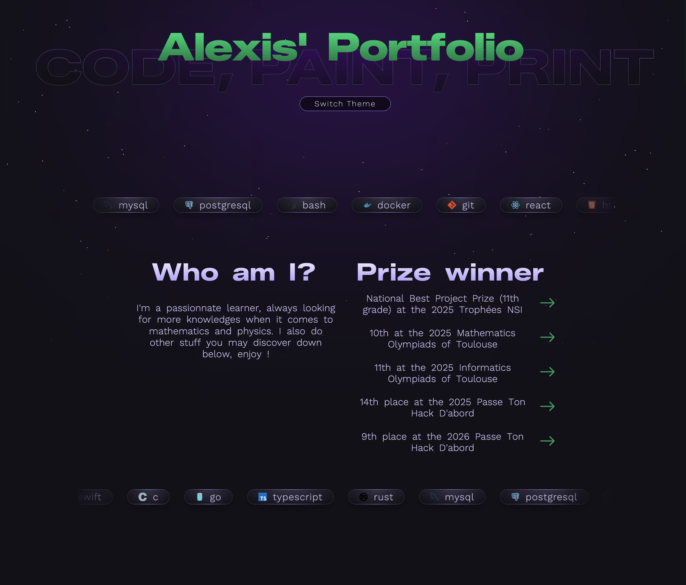

# Alexis' Portfolio

This is my portfolio where I showcase everything I create.  
You can find it live on [my website](https://pifpafdeluxe.fr).

I tried to make something original by not following the "over-minimalism" trend that everyone seems to love nowadays. This project is more experimental, featuring innovative effects and a unique style. Therefore, I truly hope you enjoy it.

**Heads up:** If you're visiting the website on a **shitty computer**, you might experience some performance issues.

The site is fully responsive, though I highly recommend the desktop experience to fully appreciate the mouse interactions and other heavy effects that I had to disable on mobile for better readability.

### Architecture
From a technical standpoint, I created a custom class system to manage effects. This allows me to access window listeners and a centralized animation frame, handling the heavy calculations efficiently while imposing limits on the processes opened by the browser.

# Examples

> 
> **The first thing you see**

> 
> **Random illustration that nicely captures the portfolio vibe**